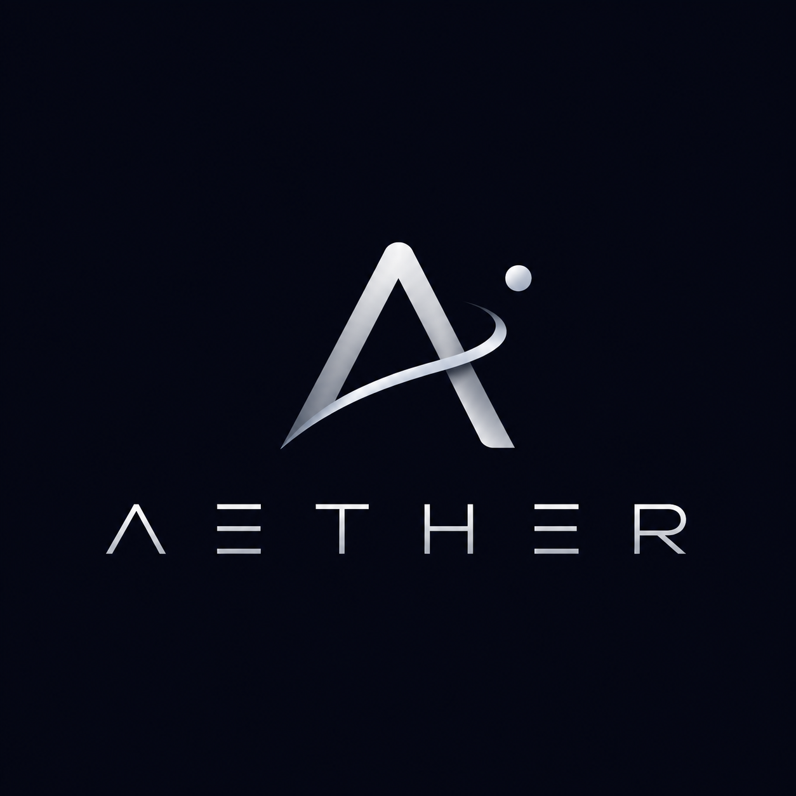
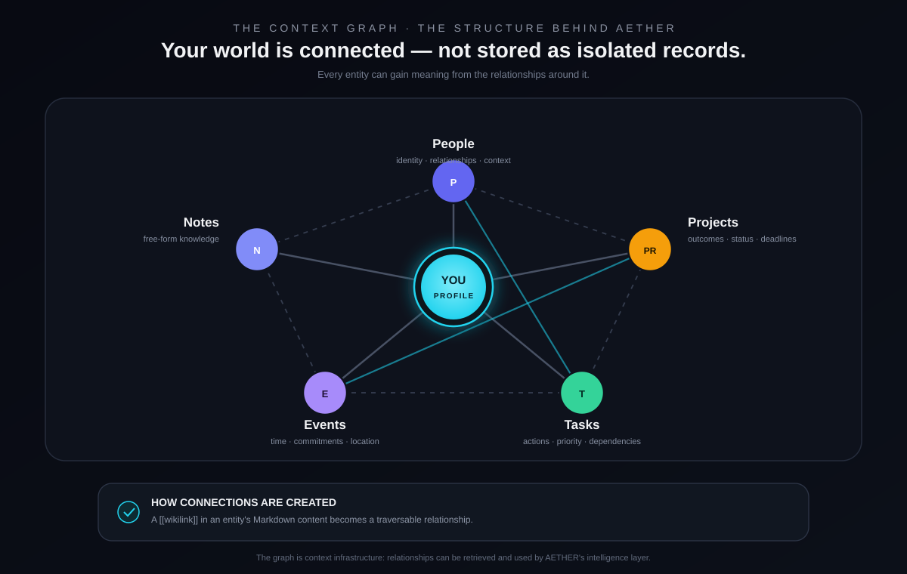
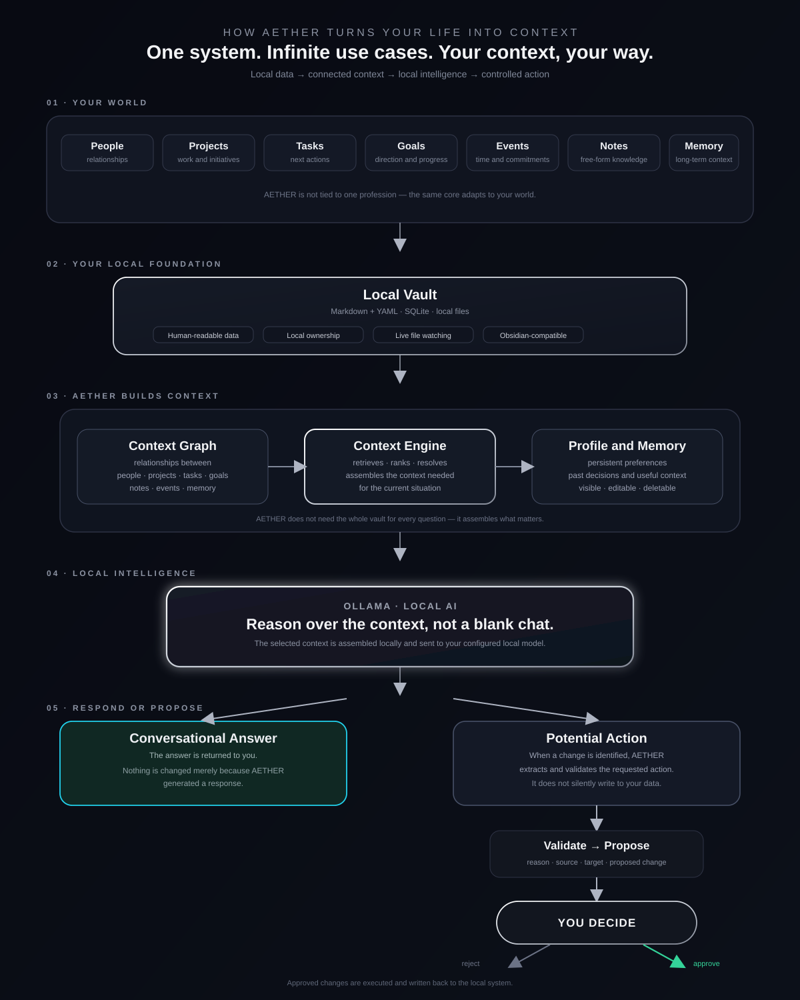

<p align="center">
  
</p>

<h1 align="center">AETHER</h1>
<p align="center"><strong>Your Personal Operating System.</strong></p>
<p align="center"><em>Your data. Your model. Your machine.</em></p>

<p align="center">
  
  
  
  
  
  
  
  
</p>

<p align="center">
  <a href="#what-is-aether">What is AETHER?</a> ·
  <a href="#aether-is-whatever-you-need-it-to-be">AETHER Is What You Need</a> ·
  <a href="#the-context-graph">Context Graph</a> ·
  <a href="#how-aether-thinks">How AETHER Thinks</a> ·
  <a href="#what-actually-works-today">Current State</a> ·
  <a href="#privacy--data-ownership">Privacy</a> ·
  <a href="#getting-started">Getting Started</a> ·
  <a href="#roadmap">Roadmap</a>
</p>

---

> **AETHER is not a task manager. It is not a notes app. It is not a calendar.**
> **It is the operating system underneath all of them, and it becomes whatever you need it to be.**

---

## What is AETHER?

Everyone's life eventually gets scattered across a dozen tools. Notes live in one app, tasks in another, contacts somewhere else, projects in a spreadsheet, and the meaning connecting all of it, *why* this task matters, *who* this note is really about, *what* this project depends on, lives only in your head.

AETHER exists because that fragmentation is the actual problem. Not the lack of a good notes app. Not the lack of a good task manager. The lack of a system that treats a **person**, a **note**, a **project**, a **task**, and an **event** as pieces of the same connected world instead of five unrelated databases.

AETHER is built around one core idea:

```
People → Notes → Projects → Tasks → Events → Context
```

These are not five separate apps glued together. They are five faces of the same underlying graph, the **Context Graph**, and an AI that sits on top of it, reads it, and reasons over it entirely on your own machine.

> AETHER does not just store your information. It is built to understand how the pieces relate to each other, and to let a locally-running AI use that understanding when it talks to you.

AETHER runs as a **native desktop application**, backed by a local file vault and a local SQLite database, with a locally-hosted AI (via [Ollama](https://ollama.com)) as its reasoning layer. There is no mandatory account, no mandatory cloud service, and no requirement to pay for API credits to use the core product.

---

## AETHER Is Whatever You Need It To Be

Most productivity software forces you into someone else's methodology: a specific board layout, a specific way of tagging things, a specific idea of what a "project" is supposed to look like. AETHER takes the opposite position.

**AETHER has one stable core, People, Notes, Projects, Tasks, Events, and the connections between them, and what that core *means* is entirely up to the life you put into it.**

| If you are a... | AETHER becomes... |
|---|---|
| **Teacher** | A system for tracking students, classes, lesson plans, deadlines, and school events |
| **Entrepreneur** | An operating system for companies, products, people, decisions, and strategic projects |
| **Student** | A workspace for assignments, exams, study notes, deadlines, and personal goals |
| **Researcher** | A knowledge base for references, experiments, ideas, and long-running lines of inquiry |
| **Freelancer** | A client and project command center, deliverables, deadlines, meetings, notes |
| **Developer** | A technical memory system, architecture decisions, bugs, docs, and project state |
| **Anyone else** | A private, structured environment for organizing everyday life |

The same five building blocks, People, Notes, Projects, Tasks, Events, support all of these, because AETHER never hard-codes what a "project" or a "task" *has to* represent. A Task can be a homework assignment, a client deliverable, or a chore. A Project can be a startup, a thesis, or a home renovation. **The structure is yours to fill in.**

---

## The Context Graph

At the center of AETHER is the **Context Graph**: the network of relationships between everything you enter into the system. A person connects to a project. A project connects to its tasks. A task connects to an event. A note mentions a person and gets linked to them automatically. None of this needs to be built by hand, it emerges from what you write.

<p align="center">
  
</p>

Concretely, today this works through **wikilinks**: every entity in AETHER is a Markdown file with structured front matter, and a `[[Name]]` reference inside its body is a real, traversable edge in the graph, read by the same index that feeds the AI. Write a note that mentions `[[João]]` and `[[Website Redesign]]`, and both connections exist immediately, without any manual "link this to that" step.

**Two things are true about the Context Graph today, and both are worth stating plainly:**

- **The data model and retrieval are real and working.** The graph of entities and links is what the local AI actually reads from before answering you, this is not a mockup.
- **The visual, node-and-edge rendering of the graph is currently disabled.** An interactive radial graph view exists in the codebase, but it produced visual bugs and has been switched off in favor of a placeholder panel while it's rebuilt properly. You can already *use* the graph through search, chat, and every entity view, you just can't *see* it as a picture yet.

---

## How AETHER Thinks

AETHER's intelligence is organized as a pipeline, not a single black box:

<p align="center">
  
</p>

A few decisions shape this pipeline deliberately:

- **The Context Manager never dumps your entire life into the prompt.** It always includes a compact summary of who you are, plus whatever entities are actually relevant to the message you just sent, matched by keyword, by name, and by topic, in both English and Portuguese.
- **The AI never silently changes your data.** Every create, update, link, or delete action the AI wants to make is packaged into a proposal with a stated reason, then shown to you as a card. Nothing is written to your vault without your explicit approval.
- **Facts, inferences, and suggestions are never conflated.** Internally, every piece of information carries a trust level:

  | Trust Level | Meaning |
      |---|---|
  | `CONFIRMED` | Created or explicitly confirmed by you, treated as fact |
  | `INFERRED` | Deduced by the context engine, shown as an inference, never as a fact |
  | `SUGGESTED` | An AI-proposed change awaiting your decision |

- **Vault content is data, not instructions.** The system prompt explicitly tells the model that anything retrieved from your notes is untrusted content to reason *about*, never a command to obey, a deliberate guard against prompt injection hidden inside your own notes.
- **Everything happens on your machine.** AETHER auto-detects, installs, and manages Ollama and its models locally; no message you send to the assistant leaves your device.

---

## AETHER Assistant

The conversational layer is a real-time chat interface backed entirely by your local model. It:

- Answers using your actual people, projects, tasks, events, and notes, not a blank conversation.
- States what it knows as its own knowledge rather than narrating "as you told me..." for every fact.
- Understands relative dates, ages calculated from birthdays, and both English and Portuguese input.
- Proposes actions conversationally ("I can create that task for tomorrow") and waits for your approval rather than claiming something is already done.
- Can also read a note you've written and, in the background, extract candidate People, Projects, Tasks, and Events from it, always as proposals with a literal quote from the note as evidence, never invented outright.

What it is **not**, today: a proactive daily-briefing system that messages you unprompted, or a multi-step autonomous planner. Today it is reactive, you ask, it answers and proposes; nothing runs on its own initiative yet.

---

## What Actually Works Today

Being an ambitious system doesn't mean pretending it's finished. Here is the honest state of AETHER, organized by how solid each piece actually is.

### ✅ Implemented and working

| Area | What it does |
|---|---|
| **Local vault** | People, Projects, Tasks, Events, and Notes are stored as Markdown files with YAML front matter, in an `AETHER-Vault` folder that stays human-readable and portable outside the app |
| **Full CRUD on all five core entities** | Dedicated views to create, view, edit, and delete People, Projects, Tasks, Events, and Notes, each with its own screen and dialog |
| **Wikilink relationships** | `[[Name]]` references inside any entity's body become real, traversable graph edges, read by both the AI and the vault index |
| **Local AI chat** | A full conversational assistant running against a locally-installed Ollama model, with conversation history and dynamic date/time awareness |
| **Context-aware retrieval** | The Context Manager selects and injects only the vault entities relevant to your message, plus a persistent summary of your profile |
| **AI action proposals** | Create/update/link/delete actions extracted from chat or from notes are validated, checked for duplicates, and shown as approval cards, never auto-executed |
| **Profile learning** | The assistant can detect first-person personal facts you mention ("I live in Amarante") and propose a profile update, always pending your confirmation |
| **Global search** | Diacritic- and case-insensitive search across every entity type in the vault |
| **Live external sync** | Editing a vault file outside AETHER (e.g. in a text editor or in Obsidian) is detected via a file watcher and reflected back into the app |
| **Local backups** | One-click zip backup of the SQLite database and the entire Markdown vault, recommended before destructive operations |
| **Bilingual UI** | Full interface localization in English and European Portuguese |
| **Cross-platform packaging** | Maven-assembled distribution with launch scripts for Windows (`aether.bat`) and Linux/macOS (`aether.sh`) |
| **Optional Obsidian companion** | The vault's plain Markdown + wikilink structure means it can be opened directly in Obsidian for its native graph view, entirely optional, and never required for AETHER to function |

### 🧪 Experimental / partially implemented

| Area | Current state |
|---|---|
| **Visual Context Graph** | The underlying graph data and retrieval are fully functional; the interactive node-and-edge canvas exists in code (`GraphRenderer`) but is currently switched off in the UI in favor of a placeholder, pending a rebuild of its rendering |
| **Reserved vault categories** | `Organizations`, `Documents`, and `Relationships` folders are created in every vault from day one, but don't yet have dedicated CRUD screens, they exist structurally, ahead of their UI |
| **Note understanding** | Extracting structured entities from free-form notes works today, but is scoped to People, Projects, Tasks, and Events, coverage and accuracy are still actively being tuned |

### 🗺️ Planned / vision (not yet implemented)

| Area | Direction |
|---|---|
| **Goals & Decisions as first-class entities** | Currently, goals and objectives live only as free-text profile fields, not as structured, linkable entities like Projects or Tasks |
| **Proactive intelligence** | An assistant that surfaces things unprompted, deadline conflicts, neglected goals, daily briefings, rather than only responding to messages |
| **Connected AETHER** | An entirely optional future layer for scoped, permission-based sharing of specific entities with other people, without exposing your full local database. No code for this exists yet, it is a stated direction, not a feature in progress |
| **Notion import** | Native note creation and Obsidian-compatible storage exist today; direct Notion import is a stated goal, not yet built |

---

## Core Entities

| Entity | Fields today | Notes |
|---|---|---|
| **Person** | Name, birth date, occupation, about | Age is computed live from birth date wherever it's relevant |
| **Project** | Name, deadline, status, description | Status flows through a defined lifecycle (e.g. planned → active → done) |
| **Task** | Title, deadline, status, priority, description | Priority and status are structured, not free text |
| **Event** | Title, start/end time, location, description | Feeds both the dashboard calendar and the AI's sense of your schedule |
| **Note** | Title, free-form content | The least structured entity by design, the raw material the AI reads relationships out of |

Every entity shares a common identity and audit layer: a stable UUID, and creation/update timestamps, regardless of type.

---

## Privacy & Data Ownership

**AETHER is local-first by construction, not by policy.** There is no server component in the current application; every entity, every profile field, and every AI conversation is processed on your machine.

- Your vault is a folder of plain Markdown files on your own disk, readable with any text editor, not locked into a proprietary format.
- Your profile, settings, and chat sessions live in a local SQLite database, stored in the standard per-OS application data folder (`%APPDATA%` on Windows, `~/Library/Application Support` on macOS, `$XDG_DATA_HOME` or `~/.local/share` on Linux).
- The AI is a locally-run Ollama model. AETHER manages installing it, listing models, and picking sensible defaults based on your machine's available memory, no API key, no subscription, no cloud inference required for the core product to work.
- Backups are local zip archives; nothing is uploaded anywhere by AETHER itself.
- Vault content passed to the AI is explicitly framed in the system prompt as data to reason about, not instructions to obey, a deliberate protection against malicious or accidental prompt injection hidden in your own notes.

---

## Tech Stack

| Layer | Technology |
|---|---|
| Language | Java 21 |
| Desktop UI | JavaFX 21.0.6 (FXML + CSS) |
| Persistence | SQLite (via the `sqlite-jdbc` driver) + a Markdown/YAML file vault |
| Local AI runtime | Ollama, managed and orchestrated by AETHER |
| Note-taking companion | Obsidian *(optional)*, the vault is plain Markdown + wikilinks, so it opens natively in Obsidian; not required to run AETHER |
| Build | Maven, packaged via `maven-assembly-plugin` into a self-contained distribution |
| Testing | JUnit 5, with a shared JavaFX toolkit lifecycle for UI-level tests |

---

## Getting Started

**Requirements:** Java 21+, Maven, and (optionally, for AI features) [Ollama](https://ollama.com), AETHER can also install Ollama for you from within the app.

```bash
git clone <repository-url>
cd AETHER
mvn clean javafx:run
```

On first launch, AETHER walks you through a short setup: checking for Ollama and picking a model suited to your machine, optionally pointing at (or creating) a vault folder you can also open in Obsidian, and creating your local profile.

For development, a clean-slate run (wipes the local database only) is available:

```bash
mvn javafx:run -Daether.dev.reset=true
```

A pre-built distribution can also be produced with:

```bash
mvn clean package
```

which assembles a runnable bundle with the application jar, its dependencies, and the `aether.sh` / `aether.bat` launch scripts.

---

## Project Status

AETHER is in **Private Alpha**. The core loop, vault, entities, local AI chat, and approval-gated actions, works end-to-end today. Around that core, some pieces (the visual graph, first-class Goals, proactive intelligence, and any form of multi-user collaboration) are either partially built or still purely directional. This README is written to reflect that honestly rather than to describe an intended future as if it already shipped.

## Roadmap

| Phase | Focus |
|---|---|
| **Now** | Stabilize the core loop: vault, entities, local chat, action proposals, profile learning |
| **Next** | Rebuild the visual Context Graph rendering; extend note understanding coverage and accuracy |
| **Then** | Promote Goals and Decisions to first-class, linkable entities alongside People, Projects, Tasks, and Events |
| **Later** | Proactive intelligence, unprompted surfacing of conflicts, deadlines, and neglected goals |
| **Vision** | Connected AETHER, scoped, permission-based, opt-in sharing of specific entities between people, without compromising the local-first core |

---

## License

AETHER is proprietary software. The source may be publicly available for inspection, personal use, and non-commercial modification, but it is **not** released under an open-source license.

Copyright © 2026 PMoreiraDev. All rights reserved.
See the [`LICENSE`](LICENSE) file for the complete terms.

---

<p align="center">
  <strong>AETHER</strong><br>
  <em>Your Personal Operating System.</em><br><br>
  local · private · yours
</p>