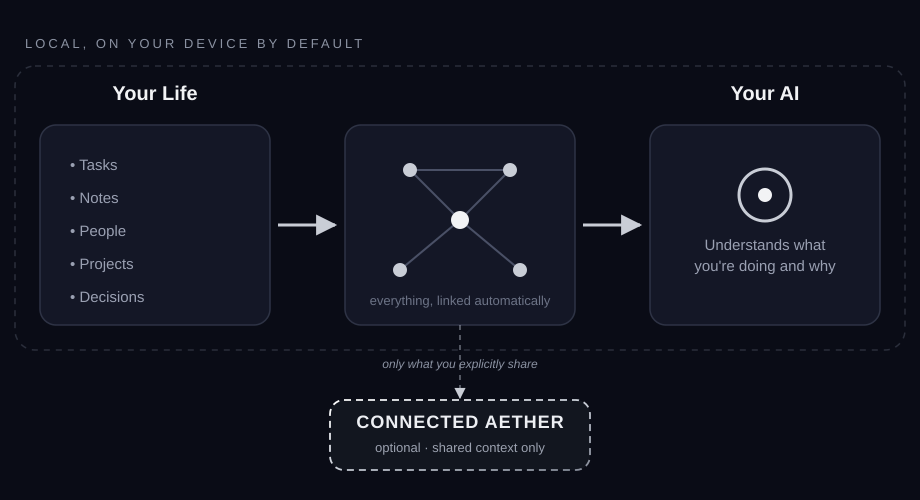
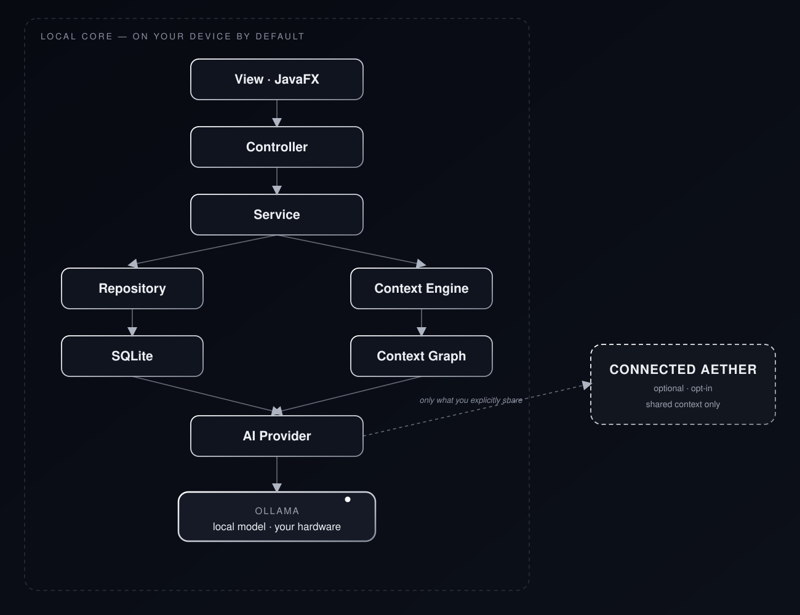

<p align="center">
  
</p>

<p align="center">
  <strong>Your personal operating system.</strong><br>
  <em>Local. Private. Intelligent.</em>
</p>

<p align="center">
  
  
  
  
  
  
</p>

<p align="center">
  <a href="#what-is-aether">What is AETHER?</a> ·
  <a href="#the-context-graph">Context Graph</a> ·
  <a href="#aether-advisor">Advisor</a> ·
  <a href="#privacy--local-first">Privacy</a> ·
  <a href="#connected-aether">Connected AETHER</a> ·
  <a href="#roadmap">Roadmap</a> ·
  <a href="#getting-started">Getting Started</a>
</p>

---

## What is AETHER?

**AETHER is a local-first personal operating system** that understands, organizes, and helps plan your life: notes, tasks, projects, goals, calendar, people, and memories.

Most tools store these as isolated records: a task manager knows tasks, a calendar knows events, a notes app knows notes. AETHER treats them as one connected graph instead. A person can link to a note, that note to a project, that project to a task, that task to a goal, and the system can reason across all of it.

> **AETHER doesn't just organize what you do. It understands the context around it.**

---

## The Context Graph

<p align="center">
  
</p>

Everything entered into AETHER (a note, an event, a task) stays fully readable, but also becomes structured context the system can use later. Write something as simple as:

> *"Had coffee with João today. He offered to help with the frontend next week. His birthday is October 14."*

and AETHER can infer a person, a project link, a time reference, and a calendar event, without you building any of it by hand. That's the Context Graph doing its job quietly in the background.

---

## How AETHER Thinks

Four layers work together:

| Layer | Role |
|---|---|
| **Context Engine** | Retrieves, ranks, and assembles relevant context from everything stored in AETHER |
| **Context Graph** | The evolving network of relationships between people, projects, tasks, goals, notes, and events |
| **AETHER Intelligence** | Runs in the background and spots relationships, conflicts, drift, and missing context |
| **AETHER Advisor** | The conversational layer that reasons over all of the above |

---

## AETHER Advisor

Ask it things like:

- *"What should I focus on today?"*
- *"What do I need to prepare before meeting João?"*
- *"Why is this project falling behind?"*
- *"Which of my goals am I neglecting?"*

The Advisor answers using your actual calendar, tasks, projects, goals, notes, and memory, not a blank conversation.

It can also surface things unprompted:

> Good morning. You have 3 events today. The AETHER project deadline is in 4 days, and two open tasks appear to be blocking the rest. Want a plan for the next four days?
> `[Create plan]  [Dismiss]`

---

## Everything Is Connected

| Entity | Connects to |
|---|---|
| **People** | Notes, projects, events, shared memories |
| **Projects** | Tasks, goals, deadlines, people, decisions |
| **Tasks** | Projects, goals, dependencies, deadlines, people |
| **Calendar** | People (birthdays), projects, deadlines |
| **Goals** | Projects, tasks, progress over time |
| **Notes** | Any of the above, inferred automatically from what's written |

Notes stay fully free-form. You're never forced to structure them before AETHER can use them.

**Memory** is a persistent layer of long-term context (preferences, past decisions, recurring patterns) that stays fully visible, editable, and deletable, never invisible.

---

## Staying in Control

| Level | Examples |
|---|---|
| **Automatic** | Indexing, classification, context retrieval, done silently |
| **Suggested** | *"This note might belong to Project X"*, you accept or reject |
| **Approval required** | Deleting data, changing deadlines, sharing information |

> **AETHER can think ahead. You remain in control.**

---

## Privacy & Local-First

**AETHER is local-first, not local-only.** Personal data and AI context (SQLite, Memory, the Context Graph, and everything Ollama reasons over) remain on your device by default. No mandatory cloud services, no telemetry, no remote AI APIs.

Optional online services exist for a single purpose: controlled collaboration. They don't change how your personal data is stored or processed locally; they add a separate, opt-in layer for the specific things you choose to share. See [Connected AETHER](#connected-aether) below.

<p align="center">
  
</p>

---

## Connected AETHER

AETHER's core is built for one person, running locally. A future, entirely optional layer, **Connected AETHER**, will let users selectively collaborate without giving up that foundation.

Sharing is explicit and scoped, never a full sync of your personal database:

| Concept | Meaning |
|---|---|
| **Private Context** | Everything on your device by default: the whole graph, unless you say otherwise |
| **Shared Context** | Only the specific entities you choose to share, with whom, and for how long |
| **Permission-based sharing** | Access is granted per entity, per person, and can be revoked at any time |

Sharing a project with João doesn't hand him your database. It hands him that project. Your personal notes, memories, and anything else linked to it stay private unless you separately choose to share those too:

```text
Project "AETHER Website"        →  Shared with João
 ├── Tasks & deadlines          →  Shared (part of the project)
 ├── Your personal notes on it  →  Private (stays on your device)
 └── Related memories of João   →  Private (stays on your device)
```

Planned Connected AETHER capabilities include user profiles, friends, profile sharing, shared notes, projects, tasks, events, and goals, collaborative workspaces, and shared Context Graphs, all governed by the same permission domain. This layer is a future direction (see Roadmap, Phase 9) and isn't required for AETHER's local core to be fully useful on its own.

> **Private by default. Connected by choice.**

---

## Tech Stack

| Layer | Technology |
| --- | --- |
| Language | Java 21+ |
| Desktop UI | JavaFX |
| Layout | FXML |
| Styling | CSS |
| Build | Maven |
| Database | SQLite |
| JSON | Jackson |
| Logging | SLF4J + Logback |
| Local AI | Ollama |

---

## Roadmap

The Context Graph and intelligence layer come before advanced AI behavior, and that order is deliberate.

| Phase | Focus |
| --- | --- |
| 1 · Foundation | JavaFX shell, SQLite, migrations, core domain domain |
| 2 · Core Organization | Tasks, projects, goals, calendar, notes, search, dashboard |
| 3 · Entities & Context | People, relationships, events, entity linking, graph traversal |
| 4 · Knowledge Layer | Note indexing, metadata, personal memory |
| 5 · Context Engine | Retrieval, ranking, entity resolution, context assembly |
| 6 · AETHER Advisor | Ollama integration, conversational interface, daily planning |
| 7 · Proactive Intelligence | Relationship suggestions, anomaly & deadline detection, briefings |
| 8 · Advanced AETHER | Long-term memory, pattern discovery, multi-step reasoning |
| 9 · Connected AETHER | Profiles, friends, shared notes/projects/tasks/events/goals, shared Context Graphs, permission-based sharing |

**Status:** early development. This README describes the intended direction; individual features may be incomplete or still in progress.

---

## Getting Started

**Requirements:** Java 21+, Maven, Git, [Ollama](https://ollama.com) for local AI.

```bash
git clone https://github.com/<your-username>/aether.git
cd aether
mvn clean javafx:run
```

Install Ollama locally and pick whichever domain fits your hardware — the domain isn't hard-coded into AETHER's core.

---

## Philosophy

> Your digital life already contains what you need to make better decisions — it's just scattered across too many places. AETHER connects it, reasons over it, and leaves you in control.

---

<p align="center">
  <strong>AETHER</strong><br>
  <em>Your personal operating system.</em><br><br>
  local · private · intelligent
</p>

## License

AETHER is proprietary software.

Copyright © 2026 PMoreiraDev.

All rights reserved.

See the `LICENSE` file for the complete license terms.